# Documentacion tecnica y funcional de GaiaPulse

Esta documentacion complementa el tutorial de usuario. Su objetivo es explicar **que hace GaiaPulse**, **como esta organizada por dentro** y **como viajan los datos** desde la interfaz hasta la base de datos, sin asumir que la persona lectora ya conoce el codigo.

El documento esta escrito para perfiles mixtos: producto, QA, desarrollo backend, frontend server-rendered, DevOps liviano y futuras personas que tengan que mantener o ampliar la aplicacion.

---

## 1. Resumen ejecutivo

GaiaPulse es una aplicacion web de bienestar para un hogar compartido. Permite registrar comidas, entrenamientos, despensa, metricas corporales, datos de wearables, analisis de sangre, notificaciones y recomendaciones personalizadas.

La decision funcional mas importante es que la aplicacion trabaja con dos niveles de datos:

- **Datos del hogar**: despensa, compras, comidas compartidas, entrenamientos compartidos, sugerencias de stock.
- **Datos por persona**: consumo individual, ejercicios individuales, metricas corporales, biomarcadores, preferencias, objetivos y feedback.

Esta separacion evita un error comun en apps de bienestar compartidas: mezclar datos de una persona con los de otra solo porque viven en la misma casa.

---

## 2. Vision funcional

### 2.1. Dominios principales

| Dominio | Que resuelve | Actor principal |
|---|---|---|
| Autenticacion | Inicio/cierre de sesion con cookie firmada | Usuario |
| Onboarding/Profile | Configuracion personal, restricciones y objetivos | Usuario |
| Capture/NLP | Entrada rapida por texto o voz con confirmacion | Usuario |
| Meals | Registro de comidas del hogar con consumo por persona | Hogar + usuario |
| Workouts | Registro de sesiones compartidas con ejercicios por persona | Hogar + usuario |
| Pantry | Stock actual y movimientos de despensa | Hogar |
| Body Metrics | Peso, grasa corporal, cintura y sueño | Usuario |
| Blood Analysis | Analisis de laboratorio, biomarcadores y resumen | Usuario |
| Wearables | Importacion de Apple Health y Samsung Health | Usuario |
| Suggestions | Recomendaciones y aprendizaje por feedback | Usuario + hogar |
| Dashboard | Agregaciones, tendencias, metas y graficos | Usuario |
| Notifications | Avisos por stock, inactividad, metricas y tendencias | Usuario + hogar |
| History | Vista historica transversal | Usuario + hogar |

### 2.2. Diagrama funcional de alto nivel

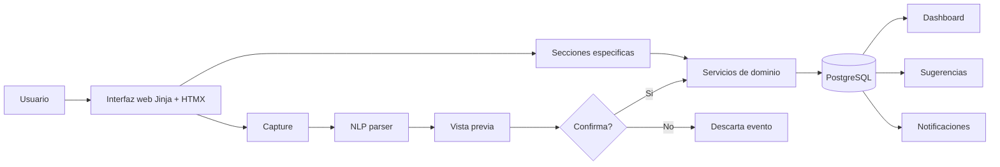

La mayoria de las funcionalidades se pueden usar desde formularios o pantallas especificas, pero **Capture** es el acceso rapido y transversal.

---

## 3. Stack tecnologico

| Capa | Tecnologia |
|---|---|
| Lenguaje | Python 3.12+ |
| Framework web | FastAPI |
| Templates | Jinja2 |
| UI dinamica | HTMX + Alpine.js |
| Estilos | Tailwind CSS por CDN |
| Graficos | Chart.js |
| ORM | SQLAlchemy 2.x |
| Migraciones | Alembic |
| Base principal | PostgreSQL |
| Tests | Pytest + SQLite in-memory |
| Auth | Cookie de sesion firmada con `itsdangerous` + `passlib[bcrypt]` |
| Jobs | APScheduler |
| NLP reglas | Parser propio por regex/keywords |
| NLP LLM | OpenAI function calling opcional |
| Voz | Whisper opcional |
| Archivos de laboratorio | PDF/imagenes procesados por integracion de analisis |

---

## 4. Arquitectura general

GaiaPulse usa FastAPI con dos tipos de rutas:

- **Web server-rendered**: devuelven HTML completo o parciales HTMX.
- **API JSON**: endpoints REST bajo `/api/v1`.

Ambas rutas comparten la misma base de modelos, repositorios y servicios.

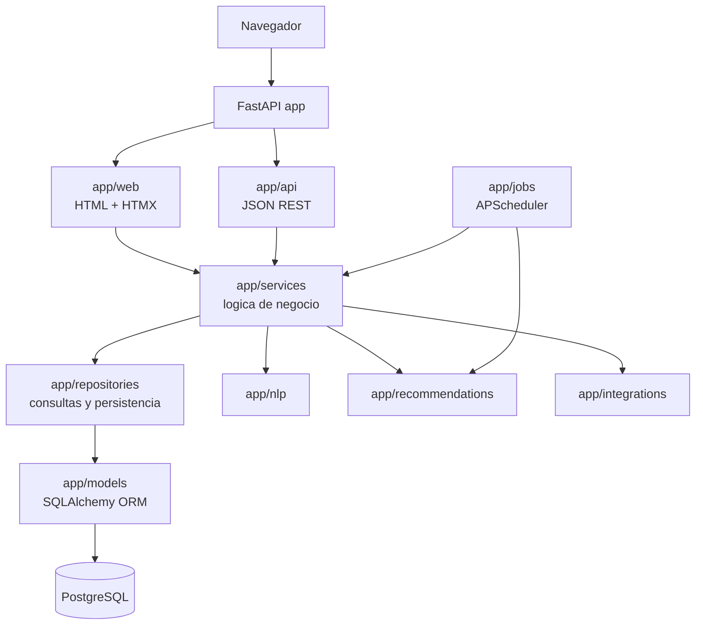

### 4.1. Capas y responsabilidades

| Capa | Responsabilidad |
|---|---|
| `app/main.py` | Crea la app, monta rutas, estaticos, middleware, lifespan y errores globales. |
| `app/web/` | Rutas HTML, templates Jinja y respuestas HTMX. |
| `app/api/` | Endpoints REST JSON versionados bajo `/api/v1`. |
| `app/services/` | Casos de uso: registrar comidas, ajustar stock, confirmar NLP, generar dashboard. |
| `app/repositories/` | Consultas SQLAlchemy reutilizables y encapsuladas. |
| `app/models/` | Entidades ORM y relaciones. |
| `app/schemas/` | Contratos Pydantic para entrada/salida. |
| `app/nlp/` | Parsing de lenguaje natural y ejecucion de intents. |
| `app/recommendations/` | Generadores, filtros, scoring y persistencia de sugerencias. |
| `app/jobs/` | Tareas programadas: notificaciones, sugerencias y digest. |
| `app/integrations/` | Adaptadores externos: STT, wearables, analisis de sangre. |

---

## 5. Enrutamiento web y API

### 5.1. Web

Las rutas web estan registradas desde `app/web/router.py`.

| Ruta | Modulo | Funcion funcional |
|---|---|---|
| `/login`, `/logout` | `web/auth.py` | Sesion de usuario |
| `/` | `web/home.py` | Home/resumen diario |
| `/capture` | `web/capture.py` | Entrada natural, preview y confirmacion |
| `/meals` | `web/meals.py` | Listado, detalle, edicion y borrado de comidas |
| `/workouts` | `web/workouts.py` | Listado, edicion y borrado de entrenamientos |
| `/pantry` | `web/pantry.py` | Stock, filtros, movimientos |
| `/body-metrics` | `web/body_metrics.py` | Metricas por persona |
| `/health` | `web/health.py` | Analisis de sangre |
| `/wearables` | `web/wearables.py` | Importacion wearable |
| `/suggestions` | `web/suggestions.py` | Sugerencias y feedback |
| `/dashboard` | `web/dashboard.py` | Graficos y agregaciones |
| `/history` | `web/history.py` | Historial transversal |
| `/profile` | `web/profile.py` | Perfil y preferencias |
| `/notifications` | `web/notifications.py` | Bandeja de avisos |
| `/insights` | `web/insights.py` | Explicaciones de insights |

### 5.2. API REST

Las APIs se montan bajo `/api/v1`.

| Prefijo | Modulo | Uso |
|---|---|---|
| `/api/v1/auth` | `api/auth.py` | Operaciones de autenticacion |
| `/api/v1/users` | `api/users.py` | Usuarios |
| `/api/v1/pantry` | `api/pantry.py` | Stock y movimientos |
| `/api/v1/meals` | `api/meals.py` | Comidas |
| `/api/v1/workouts` | `api/workouts.py` | Entrenamientos |
| `/api/v1/body-metrics` | `api/body_metrics.py` | Metricas corporales |
| `/api/v1/suggestions` | `api/suggestions.py` | Sugerencias |
| `/api/v1/notifications` | `api/notifications.py` | Notificaciones |
| `/api/v1/nlp` | `api/nlp.py` | NLP y capturas recientes |
| `/api/v1/dashboard` | `api/dashboard.py` | Datos para dashboards |
| `/api/v1/food` | `api/food.py` | Busqueda de alimentos |
| `/api/v1/export` | `api/export.py` | Exportacion de datos |
| `/api/v1/health` | `api/router.py` | Health check de app y DB |

La documentacion OpenAPI esta disponible en:

```text
/api/docs
/api/redoc
/api/openapi.json
```

---

## 6. Autenticacion, sesion y seguridad

### 6.1. Sesion

La autenticacion se basa en cookie de sesion firmada:

- Nombre por defecto: `gaiapulse_session`.
- Duracion por defecto: 7 dias.
- Firma: `APP_SECRET_KEY`.
- Hash de password: `passlib[bcrypt]`.

Las dependencias principales son:

- `get_current_user_id()`: lee y decodifica la cookie.
- `require_auth()`: carga el usuario y valida que este activo.
- `require_csrf()`: verifica CSRF en requests state-changing que lo requieran.

### 6.2. Diferencia de errores web/API

El handler global de errores diferencia entre HTML y API:

- Si una ruta `/api/...` no esta autenticada, devuelve JSON `401`.
- Si una ruta web no esta autenticada, redirige a `/login`.
- Errores `404` y `500` tambien devuelven JSON para API y templates para web.

### 6.3. Headers de seguridad

La app agrega headers globales:

- `X-Content-Type-Options: nosniff`
- `X-Frame-Options: DENY`
- `Referrer-Policy: strict-origin-when-cross-origin`
- `Permissions-Policy` con microfono permitido para self
- `Content-Security-Policy`
- `Strict-Transport-Security` en produccion

---

## 7. Modelo de datos

### 7.1. Vision entidad-relacion simplificada

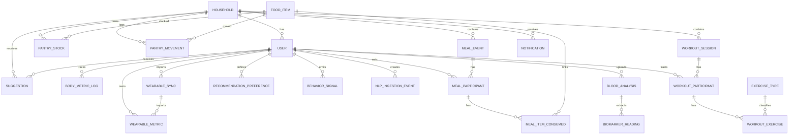

### 7.2. Tablas principales

| Tabla | Descripcion |
|---|---|
| `households` | Unidad compartida del hogar, timezone y settings. |
| `users` | Usuarios, perfil fisico, preferencias, objetivos y onboarding. |
| `food_items` | Catalogo canonico de alimentos y macros. |
| `pantry_stock` | Stock actual por alimento y hogar. |
| `pantry_movements` | Ledger/auditoria de compras, consumos, ajustes y descartes. |
| `meal_events` | Evento de comida compartido a nivel hogar. |
| `meal_participants` | Participacion de una persona en una comida. |
| `meal_items_consumed` | Items consumidos por una persona en una comida. |
| `exercise_types` | Catalogo de ejercicios. |
| `workout_sessions` | Sesion de entrenamiento compartida a nivel hogar. |
| `workout_participants` | Participacion de una persona en un entrenamiento. |
| `workout_exercises` | Ejercicios realizados por una persona dentro de una sesion. |
| `body_metric_logs` | Peso, grasa corporal, cintura, sueño y metricas asociadas. |
| `blood_analyses` | Informe de laboratorio subido por usuario. |
| `biomarker_readings` | Biomarcadores normalizados extraidos de analisis. |
| `wearable_syncs` | Importaciones desde Apple Health o Samsung Health. |
| `wearable_metrics` | Metricas importadas de wearables. |
| `suggestions` | Recomendaciones generadas y su estado. |
| `recommendation_preferences` | Preferencias explicitas o aprendidas. |
| `behavior_signals` | Señales implicitas/explicitas para aprendizaje. |
| `nlp_ingestion_events` | Entradas NLP pendientes, confirmadas o descartadas. |
| `notifications` | Notificaciones in-app. |
| `recipes` | Recetario del hogar. |

### 7.3. Patron de aislamiento por persona

Comidas y entrenamientos usan un patron de tres niveles.

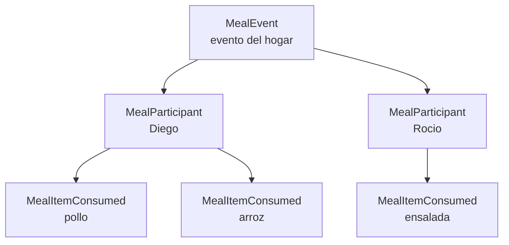

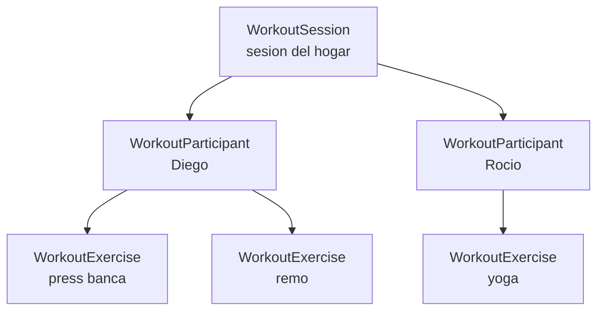

La consecuencia tecnica es importante: para calcular nutricion, historial o rendimiento individual, las consultas deben filtrar por `MealParticipant.user_id` o `WorkoutParticipant.user_id`, no solo por `household_id`.

---

## 8. Flujo principal: Capture y NLP

Capture permite registrar datos en lenguaje natural. El flujo siempre requiere confirmacion humana antes de escribir datos finales de dominio.

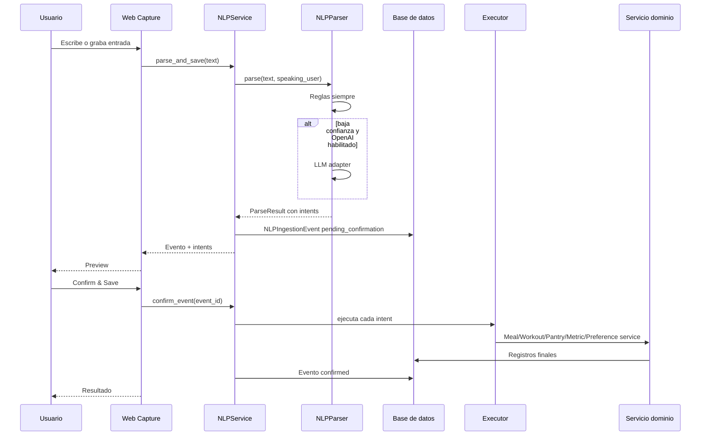

### 8.1. Capas NLP

| Capa | Cuando corre | Funcion |
|---|---|---|
| Reglas | Siempre | Detecta intents comunes con regex, keywords y heuristicas bilingues. |
| LLM | Solo si `OPENAI_API_KEY` existe y confianza de reglas `< 0.7` | Intenta mejorar el parseo con function-calling. |

El parser devuelve un `ParseResult` con:

- Lista de intents.
- Confianza global.
- Capa utilizada: `rules`, `llm` o `combined`.

### 8.2. Intents soportados

| Intent | Executor | Servicio final |
|---|---|---|
| `add_stock` | `AddStockExecutor` | `PantryService.process_purchase()` |
| `consume_stock` | `ConsumeStockExecutor` | `PantryService.adjust_stock()` |
| `log_meal` | `LogMealExecutor` | `MealService.log_meal()` |
| `log_workout` | `LogWorkoutExecutor` | `WorkoutService.log_workout()` |
| `log_body_metric` | `LogBodyMetricExecutor` | `BodyMetricService.log_metric()` |
| `update_preference` | `UpdatePreferenceExecutor` | `SuggestionService.save_preference()` |

### 8.3. Estados de un evento NLP

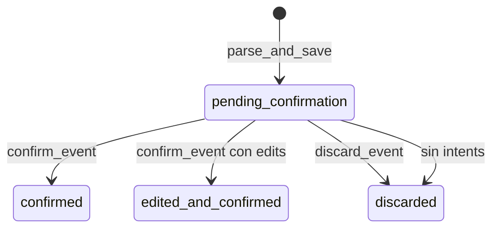

---

## 9. Servicios de dominio

### 9.1. Meals

`MealService.log_meal()` crea:

1. `MealEvent` del hogar.
2. `MealParticipant` por usuario.
3. `MealItemConsumed` por alimento/persona.
4. `BehaviorSignal` implicito por alimento consumido.

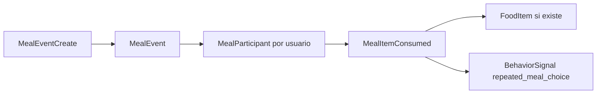

### 9.2. Workouts

`WorkoutService.log_workout()` crea:

1. `WorkoutSession` del hogar.
2. `WorkoutParticipant` por usuario.
3. `WorkoutExercise` por ejercicio.
4. `BehaviorSignal` implicito por tipo de actividad.

### 9.3. Pantry

`PantryService` mantiene dos conceptos:

- `PantryStock`: estado actual.
- `PantryMovement`: historial inmutable de cambios.

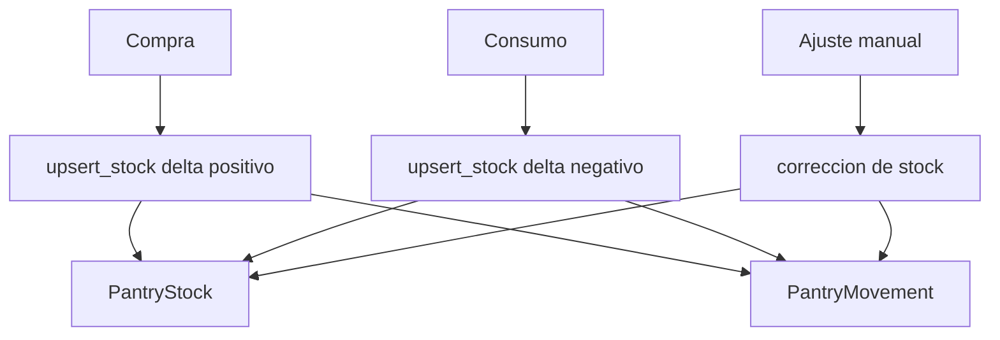

### 9.4. Body Metrics

`BodyMetricService` registra y recupera mediciones por usuario. Estas mediciones alimentan:

- Pantalla `Body Metrics`.
- Tendencia de peso en Dashboard.
- Recordatorios de metricas.
- Progreso de metas.

### 9.5. Dashboard

`DashboardService` agrega datos de varios dominios:

- Peso en 30 dias.
- Entrenamientos por semana.
- Grupos musculares entrenados.
- Tipos de comida.
- Dias activos.
- Resumen de despensa.
- Rachas.
- Metas semanales.
- Nutricion diaria.
- Biomarcadores recientes.
- Alertas de pantry.
- Relacion peso vs entrenamientos.

Es una capa de lectura/agregacion. No deberia modificar datos.

---

## 10. Motor de recomendaciones

El motor vive en `app/recommendations/` y se orquesta desde `RecommendationEngine`.

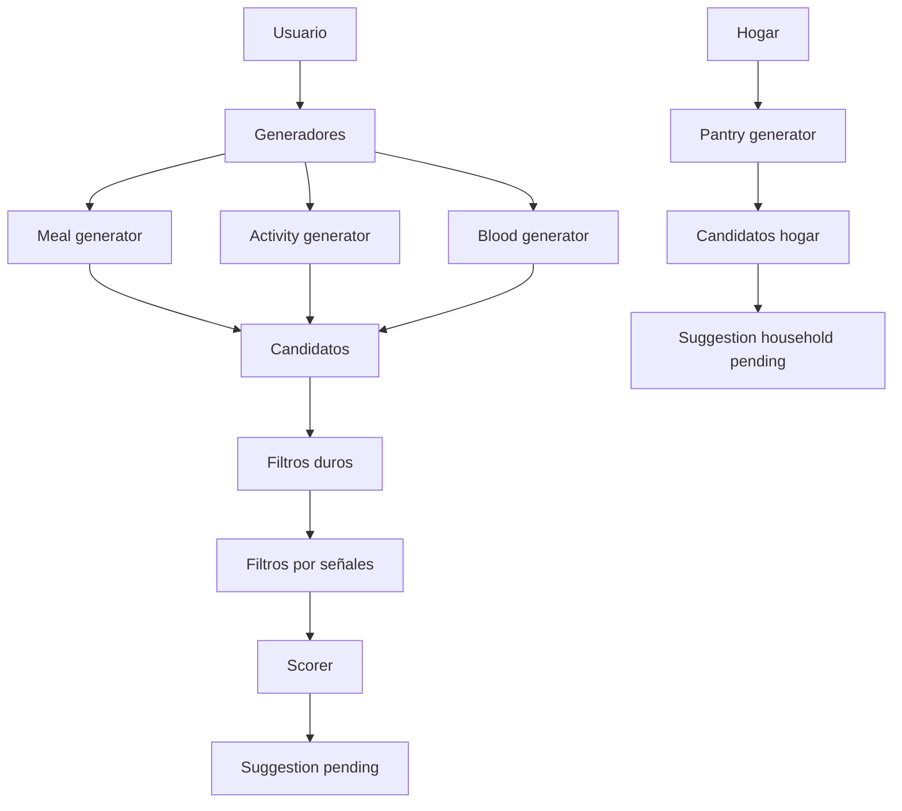

### 10.1. Generacion por usuario

`generate_for_user()`:

1. Carga preferencias.
2. Carga señales recientes de comportamiento.
3. Carga sugerencias recientes para penalizar repeticion.
4. Genera candidatos de comida, actividad y analisis de sangre.
5. Aplica constraints duros.
6. Aplica constraints por señales.
7. Puntua y rankea.
8. Persiste top-N como `Suggestion`.

### 10.2. Generacion por hogar

`generate_for_household()` genera sugerencias de despensa/compras a nivel hogar. Estas no pasan por filtros personales porque el stock es compartido.

### 10.3. Feedback y aprendizaje

Cuando el usuario responde una sugerencia:

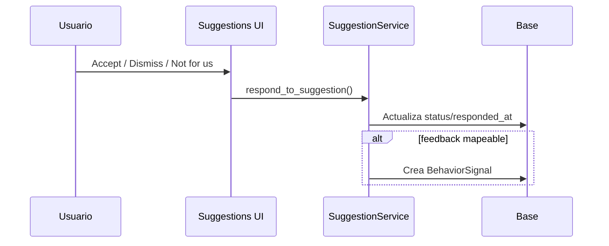

Estados principales:

- `pending`
- `accepted`
- `rejected`
- `dismissed`
- `snoozed`

---

## 11. Notificaciones y jobs

La app inicia APScheduler en el lifespan de FastAPI si `ENABLE_BACKGROUND_JOBS=true`.

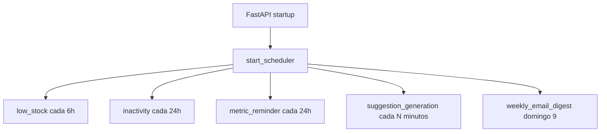

### 11.1. Jobs registrados

| Job | Frecuencia | Resultado |
|---|---|---|
| `low_stock_notifications` | Cada 6 horas | Notifica hogares con stock bajo. |
| `inactivity_notifications` | Cada 24 horas | Notifica usuarios sin entrenos recientes. |
| `metric_reminders` | Cada 24 horas | Recuerda cargar peso si falta hace varios dias. |
| `suggestion_generation` | Configurable por `SUGGESTION_JOB_INTERVAL_MINUTES` | Genera sugerencias para usuarios activos. |
| `weekly_email_digest` | Domingo 9:00 | Envia digest semanal si SMTP esta configurado. |

### 11.2. Antiduplicacion

Los jobs de notificaciones consultan si ya existe una notificacion reciente por categoria, hogar y usuario antes de crear otra. Esto evita spam.

---

## 12. Integraciones

### 12.1. Voz / STT

La captura por voz se habilita si:

- `STT_PROVIDER` no es `none`.
- Existe `STT_API_KEY` o `OPENAI_API_KEY`.

Flujo:

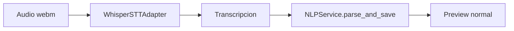

Si STT no esta configurado, Capture muestra error y recomienda usar texto.

### 12.2. Blood Analysis

`BloodAnalysisService.upload_and_analyze()`:

1. Recibe bytes, MIME type y filename.
2. Llama a `analyze_file()`.
3. Persiste `BloodAnalysis`.
4. Crea `BiomarkerReading` por marcador detectado.
5. Devuelve el registro para la pantalla de detalle.

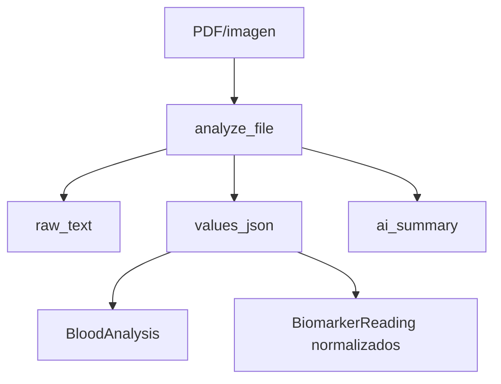

Si el parseo falla, se crea un `BloodAnalysis` con `status=error`.

### 12.3. Wearables

`WearableService` soporta proveedores:

- `apple_health`
- `samsung_health`

Flujo:

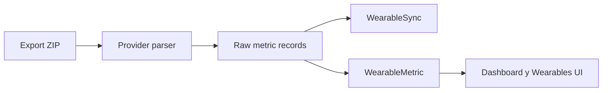

Metricas consultadas por la UI:

- `steps`
- `sleep_hours`
- `heart_rate`
- `hrv`
- `calories`
- `active_minutes`
- `weight_kg`

---

## 13. Frontend server-rendered

GaiaPulse no tiene una SPA separada. La UI se construye con:

- Jinja2 para templates.
- HTMX para updates parciales y formularios dinamicos.
- Alpine.js para estado local liviano.
- Tailwind CSS para estilos.
- Chart.js para graficos.

### 13.1. Patron HTMX

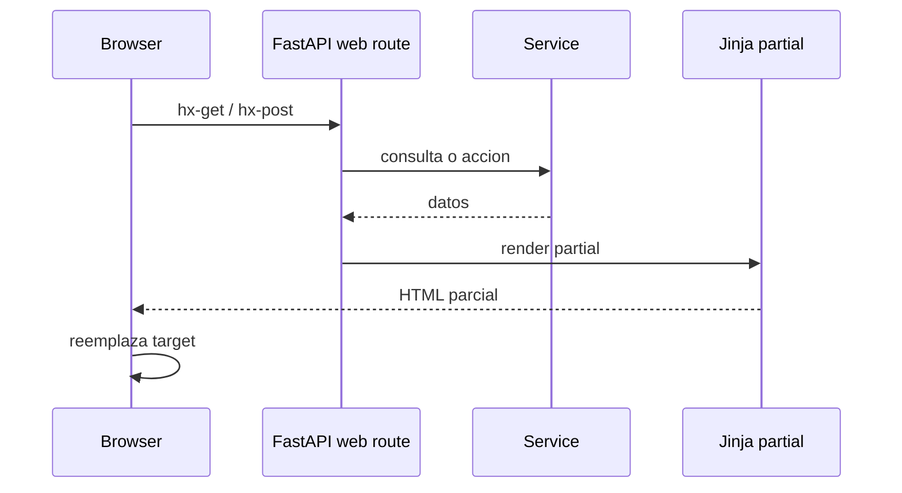

Ejemplos:

- Filtros de Meals y Workouts actualizan listas sin recargar toda la pagina.
- Pantry actualiza el grid y permite ajustes inline.
- Capture renderiza preview y resultado con parciales.
- Suggestions reemplaza una tarjeta tras feedback.
- Notifications marca o descarta avisos via HTMX.

---

## 14. Configuracion y despliegue

### 14.1. Variables de entorno principales

| Variable | Uso |
|---|---|
| `DATABASE_URL` | Conexion PostgreSQL. |
| `APP_SECRET_KEY` | Firma de sesiones y CSRF. Obligatoria segura en produccion. |
| `APP_ENV` | `development`, `staging` o `production`. |
| `APP_DEBUG` | Logging debug y reload en desarrollo. |
| `OPENAI_API_KEY` | Habilita LLM y puede habilitar STT. |
| `OPENAI_MODEL` | Modelo usado por el adapter OpenAI. |
| `STT_PROVIDER` | `none` o `whisper`. |
| `STT_API_KEY` | Clave especifica para STT. |
| `ENABLE_BACKGROUND_JOBS` | Activa/desactiva APScheduler. |
| `SUGGESTION_JOB_INTERVAL_MINUTES` | Frecuencia de generacion de sugerencias. |
| `TIMEZONE` | Zona horaria del scheduler. |
| `SMTP_*` | Envio de digest/email. |

### 14.2. Arranque Docker/Podman

El flujo containerizado aplica migraciones, seed y servidor:

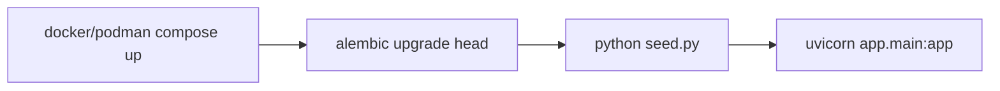

### 14.3. Arranque local

Pasos esperados:

```bash
python3 -m pip install -e ".[dev]"
cp .env.example .env
alembic upgrade head
python3 seed.py
uvicorn app.main:app --reload
```

---

## 15. Testing y calidad

### 15.1. Comandos

```bash
pytest
ruff check .
black .
mypy app/
```

### 15.2. Cobertura funcional de tests

| Archivo | Cubre |
|---|---|
| `test_nlp.py` | Parsing de intents. |
| `test_pantry.py` | Stock, compras, consumos y bajo stock. |
| `test_meals.py` | Comidas y aislamiento por participante. |
| `test_workouts.py` | Entrenamientos y aislamiento por participante. |
| `test_body_metrics.py` | Registro y lectura de metricas. |
| `test_recommendations.py` | Scoring, filtros y aprendizaje. |
| `test_notifications.py` | Ciclo de notificaciones. |
| `test_samsung_health.py` | Importacion/parsing Samsung Health. |

### 15.3. Consideraciones de test

La suite usa SQLite in-memory. En produccion se usa PostgreSQL. Las columnas JSON/JSONB pueden no comportarse identicamente en consultas complejas, por lo que cualquier feature que dependa de queries JSONB avanzadas deberia tener validacion adicional contra PostgreSQL real.

---

## 16. Convenciones de desarrollo

### 16.1. Donde agregar una funcionalidad

| Necesidad | Lugar recomendado |
|---|---|
| Nueva pantalla HTML | `app/web/` + `app/templates/` |
| Nuevo endpoint JSON | `app/api/` + schema si aplica |
| Nueva regla de negocio | `app/services/` |
| Nueva consulta reutilizable | `app/repositories/` |
| Nueva entidad persistida | `app/models/` + Alembic migration |
| Nuevo input NLP | `app/nlp/rules/`, `intents.py`, `executors.py` |
| Nueva sugerencia | `app/recommendations/generators/` |
| Nueva tarea periodica | `app/jobs/` + registrar en scheduler |
| Nueva integracion externa | `app/integrations/` |

### 16.2. Regla practica para mantener el aislamiento

Antes de escribir consultas o features nuevas, preguntarse:

> Este dato pertenece al hogar o a una persona?

Si es nutricion, rendimiento, biomarcadores, preferencias o metricas corporales, normalmente es por usuario. Si es stock o movimientos de despensa, normalmente es del hogar.

---

## 17. Riesgos y tradeoffs conocidos

| Tema | Riesgo | Mitigacion |
|---|---|---|
| Tests con SQLite | Diferencias frente a PostgreSQL en JSON/JSONB. | Probar queries complejas en PostgreSQL. |
| Tailwind CDN | No ideal para produccion estricta. | Agregar pipeline Tailwind CLI. |
| NLP por reglas | Puede fallar con frases ambiguas. | Preview obligatorio + fallback LLM opcional. |
| LLM opcional | Requiere API key y puede fallar por red/cuota. | Fallback a reglas. |
| Sesion cookie | Depende de `APP_SECRET_KEY` estable y segura. | Validacion de secret en produccion. |
| Jobs en proceso web | En multiples replicas podria duplicar jobs. | Separar worker/scheduler en despliegues multi-instancia. |
| Dos usuarios conocidos por NLP | Resolver de participantes esta pensado para Diego/Rocio. | Generalizar resolver si se agregan mas usuarios. |
| Sin realtime | Cambios de otro usuario no aparecen via push. | Agregar polling HTMX, SSE o WebSocket si hace falta. |

---

## 18. Glosario rapido

| Termino | Significado |
|---|---|
| Household | Hogar compartido. |
| Participant | Persona asociada a una comida o entrenamiento. |
| Intent | Accion interpretada por NLP. |
| NLPIngestionEvent | Registro temporal de una entrada natural pendiente/confirmada. |
| BehaviorSignal | Señal de comportamiento usada para recomendaciones. |
| Suggestion | Recomendacion persistida y respondible por el usuario. |
| PantryMovement | Movimiento historico de stock. |
| BiomarkerReading | Valor normalizado de un marcador de laboratorio. |
| WearableSync | Una importacion de datos de wearable. |

---

## 19. Lectura recomendada para nuevos contributors

Para entender GaiaPulse rapido:

1. Leer esta documentacion completa una vez.
2. Leer `README.md` para setup y contexto resumido.
3. Abrir `app/main.py` para ver como arranca la app.
4. Revisar `app/web/router.py` y `app/api/router.py`.
5. Leer los modelos `meal.py`, `workout.py`, `pantry.py` y `user.py`.
6. Leer `app/services/nlp_service.py` y `app/nlp/executors.py`.
7. Leer `app/recommendations/engine.py`.
8. Ejecutar la app con seed y recorrer el tutorial de usuario.

Con ese recorrido, la arquitectura completa queda bastante clara: GaiaPulse es una app server-rendered, con servicios de dominio explicitos, persistencia relacional, entrada natural confirmable y un motor de recomendaciones que aprende de datos y feedback.

